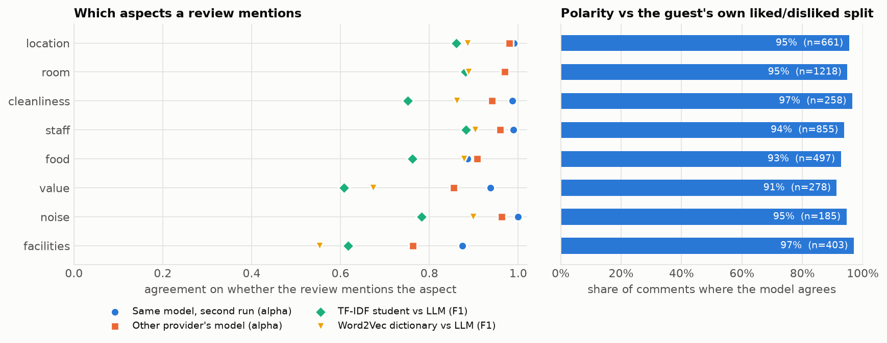
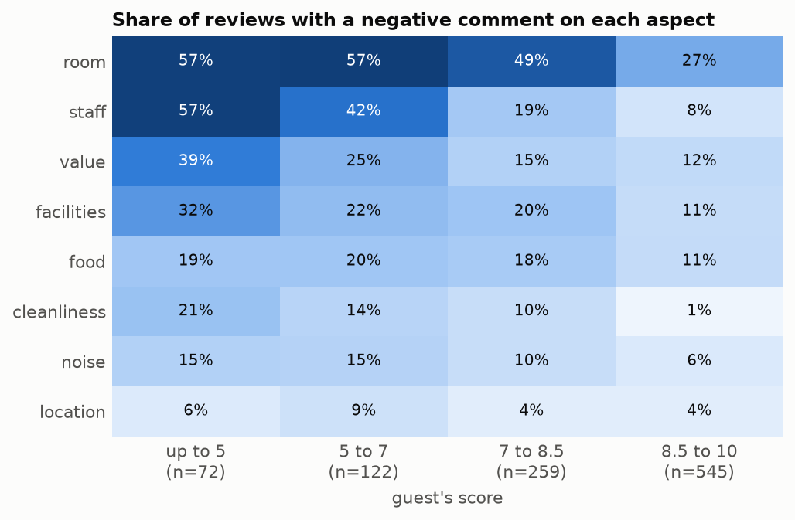
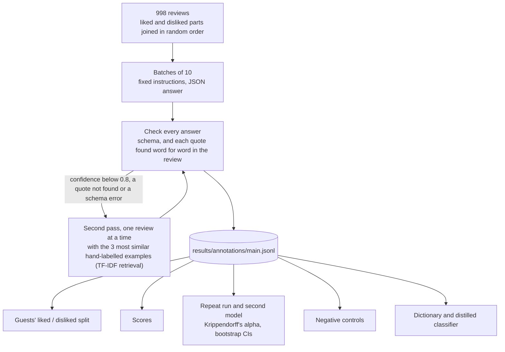

# llm-text-measurement

**English** | [简体中文](README.zh-CN.md)

[](https://github.com/jackyyangjq/llm-text-measurement/actions/workflows/ci.yml)

How I use large language models to turn text into data for research, and how I check that the measurement is right. The demonstration labels 998 public hotel reviews: which aspects of the stay each guest comments on (location, room, cleanliness, staff, food, value, noise, facilities), whether each comment is positive or negative, and a verbatim quote as evidence for every label. Then it tests the labels six ways.



## Results

The main annotator is `gpt-5.5`, called through an OpenAI-compatible API ten reviews at a time; `claude-sonnet-5` is the second model. All labels and every call's token count are in [`results/`](results/).

| Check | What it asks | Result |
|---|---|---|
| Evidence | Is every label backed by a quote that is really in the review? | 4,360 comments; 2 cited text not in the review and were redone in the second pass; none remain |
| Guests' own split | Guests file their text under "liked" and "disliked". Does the model's polarity match the box the quoted evidence comes from? | 94.6% of 4,355 comments (95% CI 93.9-95.2), Cohen's kappa 0.89; by aspect from 91% (value) to 97% (cleanliness, facilities) |
| Guests' scores | Does the overall label line up with the 1-10 score? | Mean score 9.44 for reviews labelled positive, 8.10 mixed, 5.82 negative; Spearman 0.62 |
| Repeat run | Same model, same 200 reviews, run again | Krippendorff's alpha 0.96 for which aspects are mentioned, 0.98 for their polarity; 83% of reviews get identical labels |
| Second model | `claude-sonnet-5` on 300 reviews | alpha 0.93 for mentions, 0.94 for polarity; weakest on facilities (0.76) and value (0.85) |
| Negative control | 60 short travel stories that mention nothing about the hotel | 0 comments returned |

The 5% disagreement with the guests' split is mostly the guests'. In a random 14 of the 236 disagreements, the quoted text supports the model's reading in 12: guests put praise in the "disliked" box ("Pricey but worth it", "Staffs friendly and helpful") and complaints in the "liked" one ("The service was terrible The staff were rude"). All 236 are in [`results/reviewer_disagreements.csv`](results/reviewer_disagreements.csv). Against the text itself, then, 94.6% is a lower bound.

**Cheaper substitutes.** On the 30% of reviews held out, a Word2Vec dictionary grown from five seed words per aspect reaches a macro F1 of 0.82 against the LLM's labels, and a TF-IDF logistic regression trained on the LLM's labels for the other 70% reaches 0.77. Both are fine for explicit, single-word aspects (location, room, staff: F1 0.86-0.90) and both miss implicit ones: "not worth the money" or "we paid extra for nothing" have no dictionary word, and value recall is 0.51 for both. With a few hundred labelled reviews the dictionary still beats the classifier; the classifier's advantage would come with more labels.

**What the labels show.** Among guests who scored their stay 5 or less, 57% complain about the room and 57% about staff; among those who gave 8.5 or more, 27% still have a complaint about the room but only 8% about staff. Staff complaints separate bad scores from good ones far more than room complaints do.



**Cost.** 184 calls in all runs: 181,000 prompt tokens and 416,000 completion tokens (for `gpt-5.5` these include its reasoning tokens). A batch of ten reviews took a median of 40 seconds with `gpt-5.5` and 33 with `claude-sonnet-5`.

## How it works



Design choices, and why:

- **Evidence or nothing.** Every comment has to quote the review, and `schema.check` drops any comment whose quote is not in the text (compared after lower-casing and removing punctuation). A label the text does not support is a hallucination, not a data point, and the quote makes every label checkable by a reader.
- **Ground truth without hand-coding.** The Booking.com form asks guests what they liked and what they did not, in separate boxes. Joining the two in random order hides the split from the model, and the box each quote came from becomes a label written by the guest. Hand-coding is still the standard for constructs no form captures; the agreement code (`agreement.py`) is the same either way, and its Krippendorff's alpha reproduces the worked example in Krippendorff (2011) to three decimals.
- **A second pass instead of a bigger model everywhere.** The model reports its confidence for each review. The 28 reviews below 0.8, or with a failed check, are sent again on their own with the three most similar labelled examples. That costs 28 extra calls rather than a stronger setting for all 998.
- **Two kinds of agreement.** A repeat run measures the model's own randomness; a model from another provider measures how much the labels depend on the choice of model. The second number is the one a referee should ask for.
- **A control with a known answer of zero.** Texts that mention nothing about the hotel show whether the model invents comments to fill the schema. It did not.
- **Resumable and accounted.** Answers are appended to a JSONL file as they arrive, so an interrupted run restarts where it stopped; every call's model, tokens and latency go to `results/usage.jsonl`, and the client stops at a token budget. The API key is read from the environment and never written to disk by the code.

## Where I use this

| Part | Research (status) |
|---|---|
| Evidence-grounded labelling, validation against human coding, repeat runs and a second model | PhD research on self-service technology in hotels, using guest reviews (in preparation) |
| Confidence-based second pass with retrieved examples | How listed firms describe new technology in their disclosures (in preparation) |
| Aspect-level sentiment from an LLM, aggregated into daily indices | Online sentiment about a destination in an Asian city and visitor arrivals (under review, co-author); the time-series side is in [applied-stats-econometrics-toolkit](https://github.com/jackyyangjq/applied-stats-econometrics-toolkit) |

## How to run

```bash
pip install -e ".[dev]"
pytest -q                      # 13 tests, no API calls
llmtm evaluate                 # every check and both figures, from the saved labels
```

To label again (or label your own texts, with columns `review_id` and `text`), set a key for any OpenAI-compatible endpoint:

```bash
export LLM_API_KEY=...          # LLM_BASE_URL defaults to the ChatAnywhere endpoint
llmtm annotate --model gpt-5.5 --run main
llmtm annotate --model gpt-5.5 --run rerun --n 200 --seed 1 --no-second-pass
llmtm annotate --model claude-sonnet-5 --run cross --n 300 --seed 2 --no-second-pass
llmtm annotate --model gpt-5.5 --run controls --controls --no-second-pass
```

`scripts/prepare_data.py` rebuilds the sample and the dictionary from the full 238 MB file, which it downloads; the repository keeps only the sample. Word2Vec is trained with four threads, so a rebuilt dictionary can differ in a few words.

## Layout

```text
src/llmtm/
  data.py        the sample: joining the liked and disliked parts
  schema.py      instructions, aspects, and the checks on every answer
  client.py      OpenAI-compatible client with retries, a usage ledger and a token budget
  annotate.py    batches, cache, second pass with retrieved examples, negative controls
  agreement.py   Cohen's kappa, Krippendorff's alpha, F1, bootstrap intervals
  dictionary.py  Word2Vec seed expansion and dictionary tagging
  evaluate.py    the six checks and the substitutes
  plots.py       the figures
data/reviews_sample.csv
results/         labels per run, usage, evaluation.json, disagreements, dictionary
tests/
```

## Limitations

- **One domain, one language.** English hotel reviews are easy for a current model; the same checks on harder text (earnings calls, policy documents, Chinese social media) will give lower numbers, which is why they are worth running.
- **The guests' split is ground truth only for polarity.** It says nothing about whether the model found every aspect a review mentions; for that, agreement between runs and models is the evidence here, and hand-coding a sample is the next step.
- **Confidence is self-reported.** The model's confidence is used only to route reviews to a second look, not as a probability.

## Data and references

Reviews: "515K Hotel Reviews Data in Europe" by Jiashen Liu, scraped from Booking.com (2015-2017), [Kaggle](https://www.kaggle.com/datasets/jiashenliu/515k-hotel-reviews-data-in-europe), CC0 public domain. The 998-review sample in `data/` is drawn from it.

- Gilardi, F., Alizadeh, M. and Kubli, M. (2023). ChatGPT outperforms crowd workers for text-annotation tasks. *PNAS*, 120(30), e2305016120.
- Krippendorff, K. (2011). Computing Krippendorff's alpha-reliability. Annenberg School for Communication, University of Pennsylvania.
- Mikolov, T., Chen, K., Corrado, G. and Dean, J. (2013). Efficient estimation of word representations in vector space. arXiv:1301.3781.
- Ziems, C. et al. (2024). Can large language models transform computational social science? *Computational Linguistics*, 50(1), 237-291.

## License

MIT for the code; the review sample is CC0.
