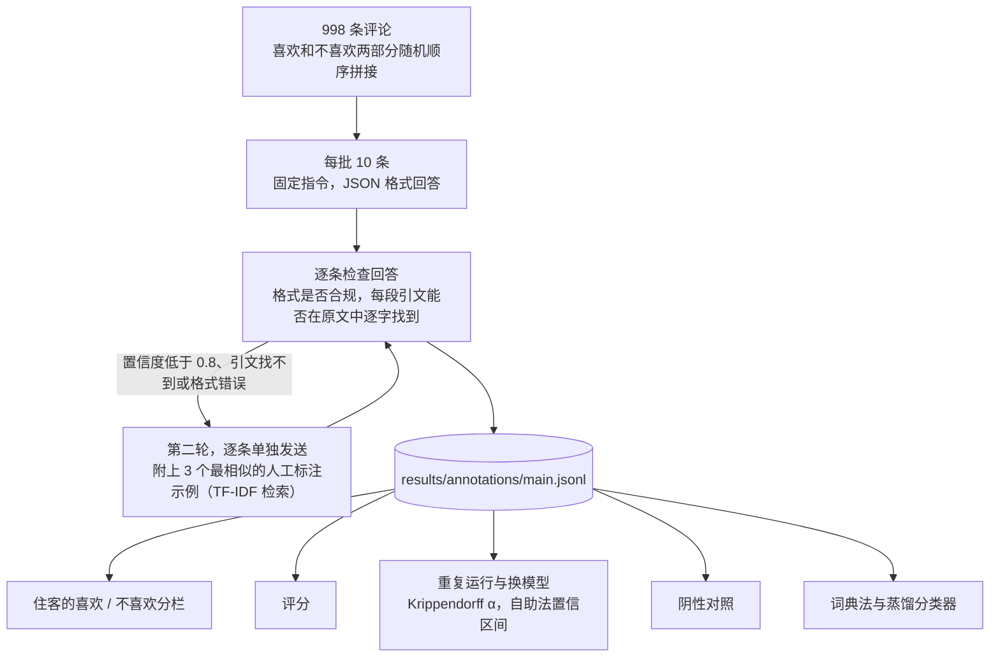

# llm-text-measurement（用大模型做文本测量）

[English](README.md) | **简体中文**

[](https://github.com/jackieyangjq/llm-text-measurement/actions/workflows/ci.yml)

这里演示我在研究中如何用大语言模型把文本变成数据，以及如何检验这种测量是否可靠。演示对象是 998 条公开的酒店评论：让模型找出每位住客评论了住宿的哪些方面（位置、房间、清洁、员工、餐饮、性价比、噪音、设施），判断每条评论是正面还是负面，并为每个标签逐字引用原文作证据。然后从六个角度检验这些标签。


## 结果

主标注模型是 `gpt-5.5`，通过兼容 OpenAI 的接口调用，每次 10 条评论；对照模型是 `claude-sonnet-5`。全部标签和每次调用的 token 用量都在 [`results/`](results/) 里。

| 检验 | 问的是什么 | 结果 |
|---|---|---|
| 证据 | 每个标签引用的原文，是否真的出现在评论里？ | 共 4,360 条方面评论；有 2 条引用的文字不在原文中，第二轮重新标注后已无此问题 |
| 住客本人的分栏 | 住客把文字分别填进"喜欢"和"不喜欢"两栏。模型判断的褒贬，是否与引文所在的栏一致？ | 4,355 条评论中 94.6% 一致（95% 置信区间 93.9–95.2），Cohen's κ = 0.89；分方面看从 91%（性价比）到 97%（清洁、设施） |
| 住客评分 | 整体标签是否与 1–10 分的评分一致？ | 标为正面、混合、负面的评论，平均分分别是 9.44、8.10、5.82；Spearman 相关 0.62 |
| 重复运行 | 同一模型把同样 200 条评论再跑一次 | 是否提及各方面的 Krippendorff α = 0.96，褒贬 α = 0.98；83% 的评论两次标签完全相同 |
| 换一个模型 | `claude-sonnet-5` 标注 300 条 | 是否提及 α = 0.93，褒贬 α = 0.94；设施（0.76）和性价比（0.85）一致性最低 |
| 阴性对照 | 60 段只讲旅行经过、完全不涉及酒店的短文 | 模型没有返回任何评论 |

与住客分栏不一致的那 5%，主要问题出在住客那边。随机抽查 236 条不一致中的 14 条，有 12 条原文支持模型的判断：住客会把称赞写进"不喜欢"栏（"Pricey but worth it"，"Staffs friendly and helpful"），把抱怨写进"喜欢"栏（"The service was terrible The staff were rude"）。全部 236 条见 [`results/reviewer_disagreements.csv`](results/reviewer_disagreements.csv)。所以若以原文本身为准，94.6% 只是准确率的下限。

**廉价替代方法。** 在留出的 30% 评论上，以大模型标签为参照：每个方面用 5 个种子词、经 Word2Vec 扩展而成的词典，宏平均 F1 为 0.82；用另外 70% 评论的大模型标签训练的 TF-IDF 逻辑回归分类器，F1 为 0.77。两者对明确、单个词就能表达的方面都够用（位置、房间、员工：F1 0.86–0.90），但都会漏掉隐含的说法："not worth the money"（不值这个钱）、"we paid extra for nothing"（多花了冤枉钱）里没有任何词典词，两种方法对性价比的召回率都只有 0.51。只有几百条标注时，词典法仍然胜过分类器；分类器要有更多标注才能显出优势。

**标签揭示了什么。** 评分 5 分及以下的住客中，57% 抱怨房间，57% 抱怨员工；评分 8.5 分及以上的住客中，仍有 27% 对房间有抱怨，但只有 8% 抱怨员工。区分差评和好评时，员工方面的抱怨比房间方面的抱怨有用得多。


**成本。** 所有运行共调用 184 次：输入 18.1 万 token，输出 41.6 万 token（`gpt-5.5` 的输出包含其推理 token）。每批 10 条评论，`gpt-5.5` 的中位耗时 40 秒，`claude-sonnet-5` 33 秒。

## 工作原理



设计取舍及原因：

- **没有证据就不算。** 每条评论都必须引用原文；`schema.check` 会丢弃引文不在原文中的评论（统一小写、去掉标点后比对）。原文不支持的标签是模型编造，不是数据；有了引文，读者也能逐条核对每个标签。
- **不用人工编码也有标准答案。** Booking.com 的表单让住客分两栏填写喜欢和不喜欢的地方。把两栏随机顺序拼在一起，模型就看不到分栏；引文来自哪一栏，就成了住客本人给出的标签。对于表单无法捕捉的概念，人工编码仍是标准做法；一致性计算代码（`agreement.py`）两种情况通用，其中的 Krippendorff α 能把 Krippendorff (2011) 例题的结果复现到小数点后三位。
- **用第二轮复核，而不是全部换更强的设置。** 模型为每条评论报告置信度。置信度低于 0.8 或检查不通过的 28 条评论，附上 3 个最相似的已标注示例单独重发。这只多花 28 次调用，而不必对全部 998 条都用更贵的设置。
- **两种一致性。** 重复运行衡量模型自身的随机性；换一家公司的模型，衡量标签在多大程度上取决于选了哪个模型。审稿人真正该问的是后者。
- **答案应当为零的对照。** 与酒店无关的文字可以检验模型会不会为了填满格式而编造评论。结果是没有。
- **可断点续跑，用量有账。** 回答一到就追加写入 JSONL 文件，运行中断后可从断点继续；每次调用的模型、token 数和耗时都记入 `results/usage.jsonl`，达到 token 预算上限时客户端自动停止。API 密钥从环境变量读取，代码不会把它写到磁盘上。

## 研究中的应用

| 部分 | 研究（状态） |
|---|---|
| 带证据的标注、与人工编码的一致性检验、重复运行和换模型对照 | 关于酒店自助服务技术的博士研究，使用住客评论（准备中） |
| 基于置信度、附检索示例的第二轮复核 | 上市公司如何在披露中描述新技术（准备中） |
| 大模型的方面级情感标签，汇总为日度指数 | 亚洲某城市的目的地网络情绪与游客到访（审稿中，合作者）；时间序列部分见 [applied-stats-econometrics-toolkit](https://github.com/jackieyangjq/applied-stats-econometrics-toolkit) |

## 运行

```bash
pip install -e ".[dev]"
pytest -q                      # 13 个测试，不调用 API
llmtm evaluate                 # 用已保存的标签重跑全部检验和两张图
```

如果要重新标注（或标注你自己的文本，需要 `review_id` 和 `text` 两列），先为任意兼容 OpenAI 的接口设置密钥：

```bash
export LLM_API_KEY=...          # LLM_BASE_URL 默认为 ChatAnywhere 的接口
llmtm annotate --model gpt-5.5 --run main
llmtm annotate --model gpt-5.5 --run rerun --n 200 --seed 1 --no-second-pass
llmtm annotate --model claude-sonnet-5 --run cross --n 300 --seed 2 --no-second-pass
llmtm annotate --model gpt-5.5 --run controls --controls --no-second-pass
```

`scripts/prepare_data.py` 会下载完整的 238 MB 数据文件，重新生成样本和词典；仓库里只保存样本。Word2Vec 用四个线程训练，所以重新生成的词典可能有少数几个词不同。

## 目录结构

```text
src/llmtm/
  data.py        样本：拼接喜欢和不喜欢两部分
  schema.py      指令、方面定义、对每个回答的检查
  client.py      兼容 OpenAI 的客户端：重试、用量记录、token 预算
  annotate.py    分批、缓存、附检索示例的第二轮、阴性对照
  agreement.py   Cohen's κ、Krippendorff α、F1、自助法置信区间
  dictionary.py  Word2Vec 种子词扩展与词典标注
  evaluate.py    六项检验与替代方法
  plots.py       作图
data/reviews_sample.csv
results/         各次运行的标签、用量、evaluation.json、不一致案例、词典
tests/
```

## 局限

- **只有一个领域、一种语言。** 英文酒店评论对当前模型来说不难；换成更难的文本（业绩电话会、政策文件、中文社交媒体），同样的检验会得出更低的数字，这也正是需要做这些检验的原因。
- **住客分栏只是褒贬的标准答案。** 它不能说明模型是否找全了评论提到的每个方面；这一点目前靠不同运行、不同模型之间的一致性来佐证，下一步是人工编码一个样本。
- **置信度是模型自报的。** 它只用来决定哪些评论需要复核，不当作概率使用。

## 数据与参考文献

评论数据：Jiashen Liu 发布的"515K Hotel Reviews Data in Europe"，抓取自 Booking.com（2015–2017），[Kaggle](https://www.kaggle.com/datasets/jiashenliu/515k-hotel-reviews-data-in-europe)，CC0 公共领域。`data/` 里的 998 条样本即从中抽取。

参考文献见[英文版](README.md#data-and-references)。

## 许可

代码采用 MIT 许可；评论样本为 CC0。
